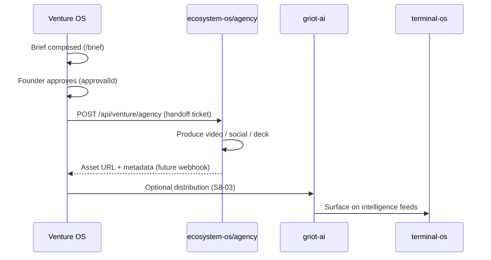

# Agency handoff workflow

Venture OS is the **approval gate**. Agency (`ecosystem-os/agency`) is the **finish lane** for video and campaign assets.

## Flow



## Handoff contract

Invoke only after `approvalStatus === "approved"` in Venture OS workflow state.

```bash
curl -s -X POST http://localhost:3000/api/venture/agency \
  -H 'Content-Type: application/json' \
  -d '{
    "briefId": "brief-42",
    "approvalId": "appr-9",
    "approvalStatus": "approved",
    "clientId": "gtcx",
    "title": "Q2 investor narrative refresh",
    "assetTypes": ["video", "social"],
    "channels": ["linkedin", "youtube"]
  }'
```

## Operator checklist (agency)

1. Pull ticket from Venture OS automation receipts (`agency_handoff`).
2. Open brief body + brand kit for `clientId`.
3. Deliver assets to agreed channels; do **not** publish externally until Venture OS publish step clears.
4. Register evidence in agency repo per fleet audit norms.

## Related

- Story: [`pm/stories/S8-02-agency-handoff.md`](../../../pm/stories/S8-02-agency-handoff.md)
- Griot ingest: [`pm/stories/S8-01-griot-webhook-adapter.md`](../../../pm/stories/S8-01-griot-webhook-adapter.md)
