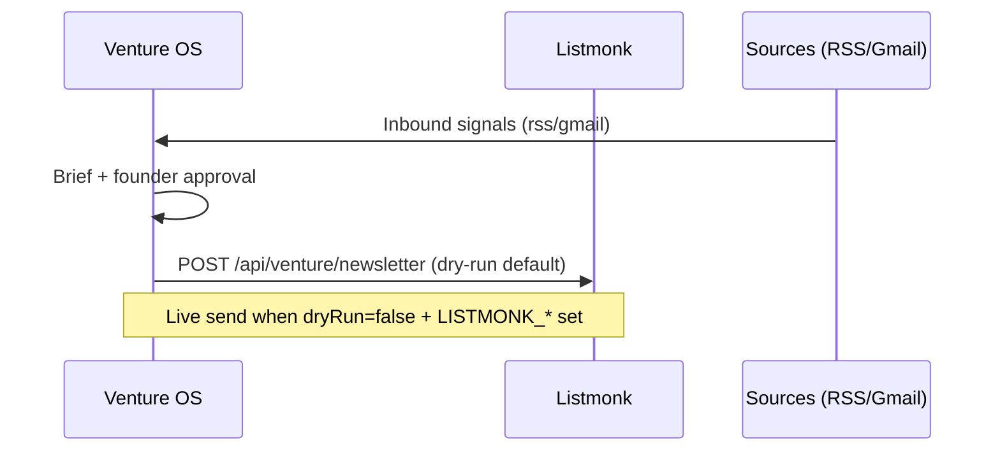

# Newsletter send workflow (Listmonk)

Venture OS gates external newsletter publish. Listmonk is the **send rail**; Griot/agency supply **content**.

## Flow



## Client → list mapping

See [`newsletter-source-registry.json`](./newsletter-source-registry.json).

## Dry-run invoke

```bash
curl -s -X POST http://localhost:3000/api/venture/newsletter \
  -H 'Content-Type: application/json' \
  -d '{
    "clientId": "terra_os",
    "approvalId": "appr-1",
    "approvalStatus": "approved",
    "subject": "June investor pulse",
    "bodyHtml": "<p>Highlights from the rolling brief.</p>",
    "dryRun": true
  }'
```

## Operator checklist

1. Confirm `approvalStatus === "approved"` in Venture OS.
2. Dry-run first — inspect `campaign` object in JSON response.
3. Set `LISTMONK_URL`, `LISTMONK_API_USER`, `LISTMONK_API_TOKEN` before live send.
4. Set `dryRun: false` only after second founder sign-off on rendered HTML.

## Related

- Story: [`pm/stories/S8-03-newsletter-send-rail.md`](../../../pm/stories/S8-03-newsletter-send-rail.md)
- Intake: [`audit/product-management/backlog/BL-NEWS-01-newsletter-source-registry.md`](../../../audit/product-management/backlog/BL-NEWS-01-newsletter-source-registry.md)
